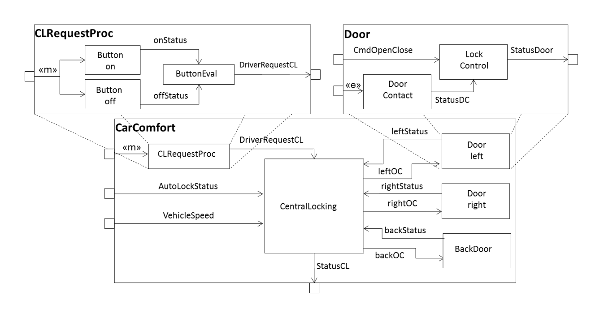

<!-- (c) https://github.com/MontiCore/monticore -->
# MontiArc and Statecharts

In this Chapter, you will design two modular DSLs and compose them into a third DSL.
The first language you will create will be *MontiArc*. 
In MontiArc, architectures can be described as component and connector systems.
The second language will be *Statecharts* which is similar to the Automata language but much more complex.
The goal of this Chapter is for you to create both grammars with the help of some models of each language
 and a short description of the languages. 
You will need to adapt the symbol table creation and create a TypeCheck and Context Conditions for both languages.
When you're finished with this task, the next goal is to compose both of these languages into a new language
 by adding the Statecharts to MontiArc. 
Therefore, you will need to try to make the components of MontiArc and Statecharts such as their symbol table creation,
Type Check and Context Conditions as reusable as possible so that you can use it in the composed language as well.

## MontiArc

As mentioned above, MontiArc is a DSL used for the description of component and connector architectures.
These architectures are used to model real systems with the help of components and connectors.
In a MontiArc model, components have a specific name and can be nested into another.
Components have incoming ports and outgoing ports that have a type such as int and a name. 
Connectors are used to link two ports of the same or different components. 
This is where type checking comes into play. 
A connector is only then well-defined if the types of the ports linked by the connector match. 
Components can be instantiated inside the model (like variables in Java) and used as types.
Their ports are similar to attributes in Java.

An example of a component and connector system that can be described by MontiArc can be found in the following picture:

|                 |
|:--------------------------------------------------------------------------| 
|  Figure 6.1: Example Component and Connector system |

#### Exercise 1
Create a grammar MontiArc that can parse the models that you can find under 
`src/test/resources/tutorial/montiarc`. 
Try to make the grammar as modular and reusable as possible by using interface productions and using
enough productions in the grammar.
Use the pre-existing MontiCore grammars so that you do not have to define every nonterminal anew.
After that, add types to the ports by creating a Type Check for the language and using it to synthesize MCTypes
 and expressions into SymTypeExpressions and storing these in the symbols. 
Write CoCos that check some basic rules.
These rules should include the capitalization of components and Type Checking for ports.

* Add the symbol interfaces of `de.monticore.symbols.BasicSymbols` to your productions where applicable (such as to ports, components, ...)
* Do NOT use the `de.monticore.symbols.CompSymbols` grammar and its symbol interfaces 
* `de.monticore.types.MCBasicTypes` provides productions for referencing qualified names or types
* Write junit tests to verify your progress
* You can group the CoCos in some that only require the AST to be present and others, that also require a symbol table to be created
* If you have to create a new `SymTypeExpression` to a `TypeSybol`, use the `SymTypeExpressionFactory``.
* You can modify/transform the AST before a symbol table is created
* This is a complex task, and we might iterate on it over multiple weeks

Present your progress and any issues at the meetings.
There we will discuss them and work on possible solutions. 

