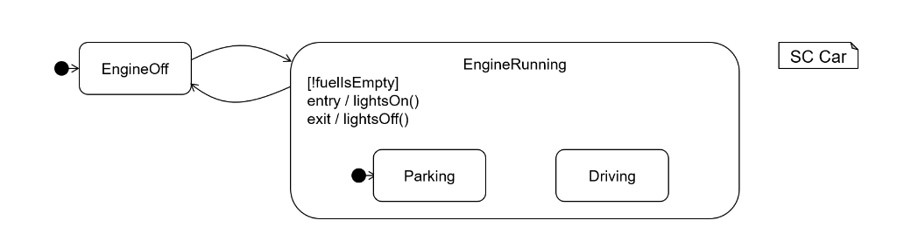

<!-- (c) https://github.com/MontiCore/monticore -->

## Statecharts

Statecharts are a comfortable language to describe behavior based on the internal state of
a component. 
They are similar to automata but much more complex. 
Statecharts have names and can contain states which can be either initial, final or regular. 
A state can have an invariant that is checked each time the state is reached, they can have initial
states with transitions and the can have different kinds of actions. 
The first action is the entry action that is executed as soon as the state is reached.
Another action is the exit action that is executed as the last action before the program switches to another state.
Transitions always link two states. 
They can have a stimulus (that looks like a method call) with optional parameters, 
 a precondition (any expression) in square brackets that should evaluate to true or false 
 and a body in curly brackets that is executed while the program transitions from one state to another. 
Events can introduce methods definitions that can be used in the stimuli.

An example of a statechart describing some basic mechanisms of a car can be found below:

|                       |
|:---------------------------------------------------------------------------------------| 
|  Figure 6.2: Statechart depicting some basic mechanisms of a car |

#### Exercise 2
Create a grammar `Statecharts` that can parse the models that you can find under
`src/test/resources/tutorial/statecharts`.
Try to make the grammar as modular and reusable as possible by using interface productions
and using enough productions in the grammar. 
Use the pre-existing MontiCore grammars so that you do not have to define every nonterminal anew.
After that, add types to events by creating a Type Check for the language and using it to synthesize MCTypes 
 and expressions into SymTypeExpressions and storing these in the symbols. 
Write CoCos that check some basic rules. 
These rules should include the capitalization of statecharts and states and 
 Type Checking for pre conditions and expressions in the body of a transition.

Note: Type Checking the statecharts may not make sense, as some try to access ports of components.
Instead, they should be added to the next composition (see the next exercise).
