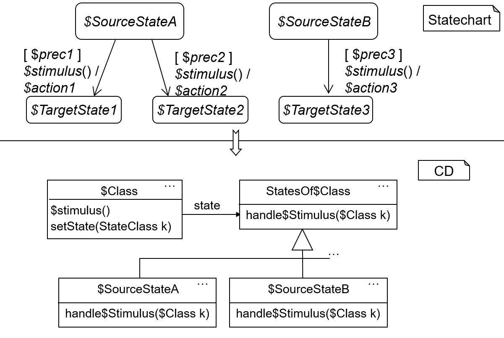

<!-- (c) https://github.com/MontiCore/monticore -->

## Statecharts Generator

After successfully designing the grammars,
 we now wish to utilize them to generate Java code from statecharts.
For this, we apply the *state pattern* design pattern:

This pattern produces an individual subclass for each state,
 one superclass (or interface) for all states,
 and one class for the statechart itself to expose the stimuli.


|                                                           |
|:--------------------------------------------------------------------------------------------------| 
| <a name="fig_6.3"></a> Figure 6.3: Example statechart (upper) and resulting class diagram (lower) |

From the given (incomplete) statechart on the upper part of the picture, 
 the lower class diagram can be derived.

The `$Class` class represents the entire statechart
 while containing a reference to the current state.
A method for each stimulus of the statechart is present (in this case `$stimulus()`).
Each state class extends the `StatesOf$Class` class,
 which defines the existence of a `handle$Stimulus($Class k)` method.
(This design pattern is language independent. In Java, we could use an interface here.)
The classes for each state, 
 such as `$SourceStateA`,
then implement the handle stimuli methods.
Instead of a large if-else or switch block,
 the handling of the stimuli is delegated to the individual state subclasses.


An example (pseudo) implementation can be seen below.

The `$Class` class also contains instances of the various state classes.
```java
class $Class {
  $SourceStateA $sourcestateA = ...;
  $TargetState1 $targetState1 = ...;
  ...
  // current state
 StatesOf$Class state;
 
 public ... $stimulus() {
   state.handle$Stimulus(this);
 }
 ...
 public void setState( ...
}
```

The `handle$Stimulus` method then checks the guard (or precondition) of a transition,
 before executing the action of a transition, and finally setting the current state of the statediagram.

```java
class $SourceStateA extends StatesOf$Class {
  public ... handle$Stimulus($Class k) {
    if ($prec1) {
      $action1;
      k.setState(k.$targetState1);
    } else 
      ...
 }
} 
```

A drawback of this pattern is, 
 that it only works on deterministic and flat (without any complex states) statecharts.
Thus, the nondeterministic parts as well as substates have to be removed.
There exists rules for both, such as the powerset construction.

#### Exercise 4
Extend the statechart tool by a generate option which generates java classes according to the state pattern.
Use a CoCo to prohibit non-flat or nondeterministic statecharts. 
Write junit test to verify your implementation 
(test if the tool reports incorrect - e.g. non-flat - models and if the generated statechart performs as expected).


Hint: Gradle provides a [`JavaExec`](https://docs.gradle.org/current/dsl/org.gradle.api.tasks.JavaExec.html) 
 task which you can use to call your tool.
 If this task is run before the  `compileTestJava` task (see [task dependencies](https://docs.gradle.org/current/userguide/tutorial_using_tasks.html#sec:task_dependencies)),
  and its output folder is added as test source set,
   you can test against your generated code.

