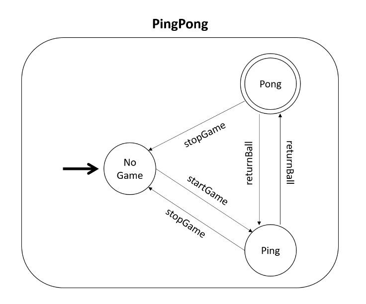
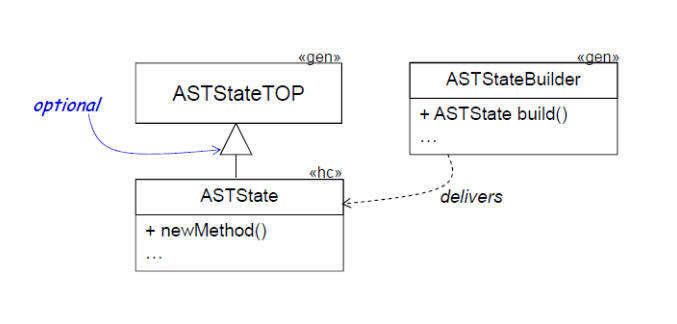

<!-- (c) https://github.com/MontiCore/monticore -->
# Automata 
## Language, Models and Grammars 
First, we will consider an automata language for 
describing finite automata consisting of states and transitions. 
Each finite automata must have an initial state and at least one final state. 
To navigate from state to state, a unidirectional transition can be used. 
A transition has a name and a source and target state.

Consider a simple ping pong game. 
To begin playing, someone has to start the game first. 
After that, the ball is returned from one player to the other until either a player cannot return a ball or the players agree to stop the game. 
If we translate this into an automaton, the resulting automaton could have three states. 
It is depicted in Figure [2.1](#fig_2.1).
The initial state `NoGame` describes the situation that the game is currently paused or has not started yet. 
To resume or start the game, the transition `startGame` can be used. 
It changes the current state to Ping, meaning that it is Player 1's turn to return the ball to Player 2. 
The transition `returnBall` is executed when Player 1 hits the ball and it is now Player 2's turn to hit it back. 
The current state is then changed to Pong. 
Another transition `returnBall` can be used after that to return the ball to Player 1 again, so that the automaton's current state is Ping again. 
This can be repeated either until one player is not able to return the ball again or both players agree to stop or end the game.
For this, two transitions `stopGame` exist that change the state from either `Ping` or `Pong` to `NoGame` again.

|  \  |
|:--------------------------------------------------------------------------------------:| 
| <a name="fig_2.1"></a> Figure 2.1: Graphical representation of the Ping Pong Automaton |


Figure [2.1](#fig_2.1) shows a graphical representation of the ping pong automaton. 
Alternatively, a textual representation like the following can be used:

```mc4
automaton PingPong {
 state NoGame <<initial>>;
 state Ping;
 state Pong <<final>>;

 NoGame - startGame > Ping;

 Ping - stopGame > NoGame;
 Pong - stopGame > NoGame;

 Ping - returnBall > Pong;
 Pong - returnBall > Ping;
}
```

It describes the same automaton as Figure [2.1](#fig_2.1). 
The name of the automaton is `PingPong` and it has three states `NoGame`, `Ping` and `Pong`. 
NoGame is the inital state and Pong the final state of the automaton.
Further, the transitions `startGame` going from NoGame to Pong, `stopGame` going from either Ping or Pong to NoGame and `returnBall` going from Ping to Pong and the other way around are included.
This textual representation however is more important than the graphical representation when working with MontiCore. 
This is because MontiCore is able to process the textual representation while it is not able to process the graphical representation.

The ping pong automaton is only one automaton out of many more. 
Automata can be created for many situations that have multiple states and transitions between those states.
The textual representation must be consistent for all possible automata and conform to certain rules. 
These rules can be constituted by a grammar. 
It specifies a syntax that all automata must adhere to and is based on the Extended Backus Naur Form (EBNF). 
A grammar consists of production rules which have a left hand side and a right hand side separated by a `=`.

The grammar constituting the Automata language is shown below. 
The Automata grammar has three such production rules: Automaton, State and Transition. 
The textual representation of an automaton must be started with the keyword `automaton`.
After that, the automaton must be given a name. 
Then, the representation of an automaton needs an opening curly bracket followed by multiple states or transitions and a closing curly bracket. 
The description of a state starts with the keyword `state` and must have a name as well. 
It can have the stereotypes `«initial»` and/or `«final»`. 
After that, either an opening curly bracket followed by other states and transitions and a closing bracket or a simple semicolon can be written to end the representation of a state. 
The representation of a transition starts with the (qualified) name of its source state and then continues with a `-`. 
After that, the input, i.e. the trigger of the transition, is followed by a `>`. 
To end the transition, the (qualified) name of the target state and a semicolon must be written.


```mc4
grammar Automata extends de.monticore.MCBasics,
                         de.monticore.types.MCBasicTypes {

 symbol scope Automaton =
        "automaton" Name "{" (State | Transition)* "}" ;

 symbol State =
        "state" Name
         (("<<" ["initial"] ">>" ) | ("<<" ["final"] ">>" ))*
         ( ("{" (State | Transition)* "}") | ";") ;

 Transition =
         from:Name@MCQualifiedName "-" input:Name ">" to:MCQualifiedName ";" ;

}
```

When comparing the grammar and textual notation above, it can be deduced that the grammar constitutes rules for the automaton language that the ping pong automaton adheres to. 
The ping pong automaton is called a model of the automaton language. 
This is similar to a Java class and an object of this class. 
The Java class specifies the structure of the object and the object fills the attributes of the class with concrete values. 
In the automaton grammar, the nonterminals on the right-hand side of a production rule like Name can be compared to attributes in a Java class. 
A model of the automaton language needs to fill these nonterminals like Name or State with concrete values, like shown above.
The grammar specifies the *abstract syntax* for models of a language while the models themselves fill the nonterminals on the right-hand side of production rules so that they contain *concrete syntax*.

Grammars can extend one another similar to Java classes. 
By doing this, they `inherit`
every production of the super grammar, so that every production of that grammar can be used. 
In this case, the Automata grammar extends two grammars that are provided by MontiCore, `MCBasics` and `MCBasicTypes`. 
The nonterminals `Name` and `MCQualifiedName` that are used in the Automata grammar are declared in those grammars respectively. 
To enable a language engineer to use basic features of (programming) languages, MontiCore supplies basic grammars that can be extended when creating a new language. 
This language then combines all these basic features and the productions in its own grammar. 
To find out about MontiCore's basic grammars, see Chapters 17-20 of the Reference Manual.

For each production of a grammar, a Java class is generated that can store all its information. 
We will use the production for Automaton as an example. 
MontiCore generates a class `ASTAutomaton` for this production. 
As the right-hand side of the production uses the nonterminals `Name`, `State` and `Transition`, the class `ASTAutomaton` has attributes `name`, `stateList` and `transitionList`, since an automaton can contain multiple states and transitions. 
The concrete word `automaton` and the curly brackets are not stored in the class however as they are not variable, i.e. are the same for every automaton. 
Such a class is generated for every production rule, meaning the classes `ASTState` and `ASTTransition` will be generated for the productions `State` and `Transition`.
All of these classes combined are called the AST (abstract syntax tree) for a language.
This is the data structure that MontiCore generates for every grammar to work with the models. 
For further explanation about the AST, see Chapter 5 of the MontiCore Reference Manual.

For every grammar that is not labeled as component (not handled here, see Section 7.3.1 of the MontiCore Reference Manual), MontiCore generates a Parser class. 
A parser can be used to read a model and create an instance of the AST conforming to the model. 
This means that an `AutomatonParser` can be used to read the Ping Pong automaton and transfer it into an instance of `ASTAutomaton`. 
The `name` attribute of this instance is filled with the string `PingPong` and the attributes `stateList` and `transitionList` are filled with instances of the `ASTState` and `ASTTransition` classes fitting to the ping pong automaton. 
Therefore, the content of the ping pong automaton is now stored in the instance of the AST created by the parser. 
This instance can now be analyzed programmatically.

#### Exercise 1
Switch to your IDE. 
Come up with your own automaton and write it down as an Automata model, i.e. follow the rules set by the Automata grammar. 
Store your file under `src/test/resources/de/monticore/gettingstarted/automata` and with the file ending `.aut`. 
After that, open the class `VisitorTest`, complete the test method `testYourModel` and execute it. 
It will read your model with the parser that was generated for the Automata language and transfer its contents into an instance of ASTAutomaton. 
Check that no error was logged.
<!-- (c) https://github.com/MontiCore/monticore -->
## Visitors 
Visitors provide the means to traverse the AST and execute different behavior for every AST node.
For every grammar `A`, MontiCore generates three interfaces `AHandler`, `AVisitor2` and `ATraverser`.
The traverser can store handlers and visitors for the grammar and delegates the traversal to them.
The handler interface provides the methods `handle` and `traverse` for every AST class and the visitor provides the methods `visit` and `endVisit` for every AST class.
For more information on these three interfaces, see Chapter 8 of the MontiCore Reference Manual.


To add your own behavior when traversing the AST, 
 you can create a class that implements the `Visitor2` interface and overrides the corresponding `visit` or `endVisit` methods. 
To use your own navigation strategy, you can create a class that implements the `Handler` interface 
 and overrides the corresponding `traverse` or `handle` methods of the interface.
These classes must be added to a traverser which can then be executed on any instance of the AST of a language.

In the context of the Automata language, it might be interesting to know how many transitions are in a particular automaton.
This can be done by creating a class `CountTransitions` that implements the `AutomataVisitor2` and that contains an attribute `count` to count the number of transitions in the automaton.
Additionally, it has an attribute `transitionInputs` that is used to store the inputs of each transition.
After that, you can override the visitor interfaces `visit` method for `ASTTransition`s and increase the `count` attribute by one for each visited transition.
The input of the transition is added to the `transitionInputs` list.
Finally, accessor methods for the attributes are added to the class.
An instance of this class can then be added to an `AutomataTraverser` and be executed on the AST.
For the ping pong automaton, the accessor method for the `count` attribute should yield the result `5`.
The implementation of the CountTransitions visitor is displayed below:

```java
public class CountTransitions implements AutomataVisitor2 {
 protected int count;
 protected List<String> transitionInputs = new ArrayList<>();

 @Override
 public void visit(ASTTransition node) {
  this.count++;
  this.transitionInputs.add(node.getInput());
 }

 public int countTransitions(){
  return this.count;
 }

 public List<String> getTransitionInputs() {
  return this.transitionInputs;
 }

}
```

#### Exercise 2
Switch to your IDE.
Look up the `CountTransitions` visitor.
Go to the `VisitorTest` class and execute it on the automaton you wrote in Exercise 1 in the test method `testYourModel`.

#### Exercise 3
The skeletons for two more visitors, `CountStates` and `AddPrefixToName` are given in the GettingStarted project.
Implement the traversal behavior for these two classes by overriding the correct methods of the `AutomataVisitor2`.
Test your implementation by removing the `@Ignore` annotation before the test methods in the `VisitorTest` class and executing the methods.
Execute the visitors on your own model from Exercise 1 in the `testYourModel` method.<!-- (c) https://github.com/MontiCore/monticore -->
## Modifying the Automata Grammar 
 
TODO:
* Insert mealy
* Insert (optional) precondition
  * mention conservative?
  * extends Expression (teaser for later)
* Show example transition
* Include test

#### Exercise TODO
 
TODO<!-- (c) https://github.com/MontiCore/monticore -->
## Context Conditions 
The MontiCore grammars that are written for creating DSLs have one problem: they are context-free. 
This means that some restrictions for a language cannot or should not be realized in a grammar. 
In the Automata language for example, an automaton must have exactly one initial state. 
This rule cannot be established in a grammar because the grammar only describes the syntax of a state. 
However, there is no mechanism for the grammar that enables counting the number of initial states of an automaton.
The production State does not know the context necessary for the restriction (there should be exactly one initial state in an automaton) and thus it cannot prevent more than one or no initial state existing in an automaton.

To add these restrictions, MontiCore offers the possibility to create Context Conditions for a language. 
Context Conditions are handwritten restrictions in the form of simple Java classes that can use the AST and visitor to check context-sensitive restrictions. 
After parsing a model and thus creating an instance of the AST of a language for this model,
a Context Condition can be applied to this AST to check that the additional context-sensitive restrictions are kept by the model. 
For this, MontiCore generates interfaces for every production of a grammar that specify a check method. 
Additionally, a `CoCoChecker` is generated that can be used to check one or more Context Conditions for a model. 
For a more detailed explanation, see Chapter 10 of the MontiCore Reference Manual.

To add the restriction from above that there must be exactly one initial state in an automaton, the class `AutomatonHasExactlyOneInitialState` displayed below was written by a language engineer. 
```java
public class AutomatonHasExactlyOneInitialState implements AutomataASTAutomatonCoCo {
    public static final String errorCode = "0xA005";

    public static final String errorMsg = " The automaton %s must have exactly one initial state";

    @Override
    public void check(ASTAutomaton node) {
        if (node.streamStates().filter(ASTState::isInitial).count() != 1) {
            Log.error(errorCode + String.format(errorMsg, node.getName()));
        }
    }
}
```
The class implements the CoCo interface that was generated for the Automaton production of the grammar Automata (`AutomataASTAutomatonCoCo`) 
 and implements its specified `check` method. 
In the method, the number of initial states of the automaton are counted and if it does not equal 1, an error is logged by the log provided by MontiCore's runtime. 
It is common to specify a different error code and error message in every CoCo so that errors in models can be retraced to a single restriction of a language.

#### Exercise 4
The skeletons for the Context Conditions `AutomatonHasAtLeastOneFinalState`,
`AutomatonNameStartWithCapitalLetter`, `StateNameStartsWithCapitalLetter` and `TransitionNameUncapitalized` are all given for the automata language.
Implement them! 
To test that the CoCos are implemented correctly, 
 execute every test except for the test `testTransitionSourceDoesNotExist` in the class `CoCoTest`.

TODO: Wenn mealy, dann überall<!-- (c) https://github.com/MontiCore/monticore -->
## Symbol Table 
Nearly every computer language needs a symbol table to reference objects. 
In Java, you can differentiate between the declaration of a variable and its use. 
This is done by giving these variables unique names. 
After their declaration, variables can be used with the help of their declared name. 
To create the connection between the reference (the use) of a variable and its declaration, the symbol table is necessary. 
It receives a name referencing a variable and tries to find the declaration of this variable by comparing it to the names of all declarations. 
Once found, the declared variable can then be used.

A symbol table consists of scopes and symbols. 
Scopes can store symbols and other scopes.
Some languages need a more complex symbol table with many nested scopes and symbols lying in those scopes while a simple symbol table without nested scopes and few symbols might suffice. 
Referring to Java, the file itself "spans" a scope in which the symbol of the class lies.
The class, in turn, spans a scope that contains all the symbols for its attributes and methods. 
Attributes do not span scopes as an attribute does not contain other things such as variables or methods, it is only declared. 
Methods however span a scope containing all the symbols for variables declared in the method. 
Usually, when using an already declared method, attribute or variable, the symbol table is used to find the symbol that the usage refers to. 
If an attribute foo is used in a method, the symbol table first looks for a variable foo that was declared in the method. 
If there is no such variable that was declared in the method, the symbol table moves up one scope in the hierarchy so that the scope spanned by the class is searched for a variable foo next. 
There, it finds the attribute that was referred to and returns its symbol. 
The process of searching for the correct symbol in the symbol table is called *symbol resolution*. 
For a more detailed description of the symbol table and how it works, see Chapter 9 of the MontiCore Reference Manual.

For every grammar, MontiCore generates a symbol table infrastructure containing three different kinds of scopes:
Global scopes, artifact scopes, and a general scope.
`Scopes` contain symbols and scopes inside a model, 
 `ArtifactScopes` contain the whole symbol table (scopes and symbols) for a model,
 and the `GlobalScope` contains every `ArtifactScopes` to make inter-model resolution of symbols possible. 
This is necessary to refer to other models from a model, e.g. to refer other Java classes in a specific Java class. 
Productions of a grammar can be annotated with the keyword `symbol` to make sure that every declaration of this production in a model results in a symbol in the symbol table. 
Additionally, productions can be annotated with the keyword `scope` to signal that a production spans a scope, like a class in Java.
MontiCore generates a mechanism that automatically creates a symbol table for an existing instance of the AST of a language. 
Next, MontiCore generates a `ScopesGenitorDelegator` classed used during the creation of a symbol table.
You can obtain an instance of this class from the `AutomataMill`.
For more information about the creation of a symbol table from the AST, see Chapter 9 of the MontiCore Reference Manual.
A state in an automaton is similar to a variable in a Java class. 
If the declaration of a variable can be compared to the `declaration` of a state (e.g. `state Ping;`), then the use of a variable can be compared to the use of a state in a transition (e.g.
`Ping returnBall > Pong`). 
This means that it is also sensible to make states symbols of the Automata language.

After parsing a model into an instance of the AST, the `ScopesGenitorDelegator` can be used to create the symbol table for this AST. 
The following method shows the simple process of creating a symbol table for a given automaton.

```java 
public IAutomatonArtifactScope createSymbolTable(ASTAutomaton node) {
    AutomataScopesGenitorDelegator del = AutomataMill.scopesGenitorDelegator();
    return del.createFromAST(node);
}
```

#### Exercise 5
Read Chapter 9 of the MontiCore Reference Manual. 
The skeleton for the Context Condition `TransitionSourceIsState` is given in the Getting Started project. 
Complete this CoCo with the help of the symbol table 
 and test your implementation by executing the test `testTransitionSourceDoesNotExist` in the class `CoCoTest`.

*Hint:* The `ASTMCQualifiedName` class has a `getQName()` method, which returns the qualified name as a String.
<!-- (c) https://github.com/MontiCore/monticore -->
## Language Tool 
For each language, a *Tool* is generated. 
This tool provides a general interface for the functionalities developed for a language. 
This includes all features such as parsing of models, creating a symbol table from the AST, checking the Context Conditions of a language, pretty printing or reporting.


For a grammar `A`, MontiCore generates the class `ATool`. 
The tool contains standard methods that are either already filled with code or empty so that they may be overwritten in a subclass of the tool. 
Methods that are filled with code contain basic functionalities that should be the same for each language such as parsing a model or creating a symbol table from an AST. 
The empty methods are empty because the functionalities they implement are not generated for every language such as checking Context Conditions, pretty printing ASTs or providing reports for a model. 
The CoCos, the pretty printer or the reports must be developed by the user first.

The empty methods must be overwritten in a subclass of the Tool while the methods that are filled with code can but do not need to be overwritten in this subclass as well. 
The subclass can be created using the *TOP mechanism*. 
For this, the user creates their own hand-written Java class that has the same name and lies in the same package as the generated class. 
The difference between the generated class and the hand-written class is that the latter is located in the *source path*, i.e. in `src/main/java`,
 while the generated class is located in the *build path*, i.e. in `target/generated-sources/monticore/sourcecode`.
After cleaning and while building the project anew with Gradle, the MontiCore generator finds the hand-written class that is named like the generated class and lies in the same package but only in the source path and, thus it adds the suffix `TOP` to the name of the generated class and makes it abstract. 
The hand-written class then can extend the generated class with the TOP-suffix so that it might use every function of the generated class and extend its implementation. 
This TOP-mechanism is supported for every generated class and allows the user to create their own hand-written extensions of the generated code without changing the usage of a class in the generated code. 
Other classes, which use the (now extended) class do not have to be changed,
 as both the hand-written class and previously "old" generated class share the same name and package.
The TOP-mechanism for the class `ASTState` can look like Figure 2.2.
The generated Builder-class uses the hand-written `ASTState` class that extends the generated `ASTStateTOP` class.


|                      |
|:-----------------------------------------------------------------------------------------------:| 
| <a name="fig_2.1"></a> Figure 2.2: Class diagram showing the functionality of the TOP mechanism |


#### Exercise 6
Create a hand-written extension for the generated class `AutomataTool`. 
First, have a look at the already generated Tool class for the Automata grammar to get an overview of which methods are already implemented and do not need to be overwritten. 
Overwrite the previously empty `runDefaultCoCos` method with the functionality to check all CoCos that were developed in Section 2.3. 
Additionally, overwrite the method `report` to create a report for an AST as a text file. 
Use the visitors implemented in Section 2.2 to collect some statistics for the states and transitions in the AST. 
Store the report in the directory `target/automata/reports` as a text file with the name of the automaton. 
For this, you will have to overwrite the `run` method and add the functionality for parsing, creating a symbol table, checking context conditions and reporting as well. 
The command for parsing, creating a symbol table and checking context conditions is `i` and for reporting is `r`. 
Use the predefined methods of the generated TOP-class for parsing, creating the symbol table,
checking context conditions and reporting. 
Your report should contain at least the following information (with the correct numbers):
> Number of States: 42
> 
> Number of Transitions: 1234
> 
> Initial State Names: NotAnExitState 
 
Check the reports for the PingPong automaton in `target/automata/reports/PingPong.txt`. 
Test your tool by executing the first two tests of the class `ToolTest`.
<!-- (c) https://github.com/MontiCore/monticore -->
## Application of Visitors: Pretty Printer 
Pretty printing is the opposite to parsing. 
The input for a parser is a text file, the model,
and its output is the AST conforming to the model. 
For a pretty printer, this is the exact opposite. 
Its input is an AST and its output is the model conforming to this AST and the language. 
A pretty printer can be useful after the AST was transformed (e.g. adding a prefix to each state name). 
Pretty printing the transformed AST and storing the contents in a file to view the transformed model might be interesting.


MontiCore attempts to generate a pretty printer for each language.
For a language `A`, the two classes `APrettyPrinter` and `AFullPrettyPrinter` will be generated.
The `APrettyPrinter` utilizes the visitor pattern and implements the `AHandler` interface.
It uses an `IndentPrinter`, a special printer provided by MontiCore, as an attribute.
The `handle` methods for each production are overwritten and instead of the default navigation being performed,
 the productions are printed during this navigation.
Simple terminals like `"automaton"`
or `"state"` in the Automata grammar can be printed with the indent printer while references to other nonterminals should be handled by delegating to the specific `handle` method.

The `IndentPrinter` can be used to add an indent to each new line after an opening curly bracket as well as removing this indent before the closing curly bracket.
The `AFullPrettyPrinter` sets up a traverser and adds the `APrettyPrinter` as a visitor.
As the `APrettyPrinter` can only handle pretty printing the nonterminals of one grammar, the nonterminals of aggregated grammars cannot be pretty printed by it.
The full pretty printer solves this, as it adds a pretty printing visitor for every language.
When discussing language aggregation later on, we will circle back to this class.


One possible handle method for `ASTAutomaton` is displayed below.

```java
public void handle(ASTAutomaton node) {
    if (this.isPrintComments()) {
      CommentPrettyPrinter.printPreComments(node, getPrinter());
    }
    getPrinter().print("automaton ");
    getPrinter().print(node.getName());

    if (node.isPresentAutAttributes()) {
      node.getAutAttributes().accept(getTraverser());
    }
    getPrinter().println("{");
    getPrinter().indent();
    node.getStateList().forEach(s -> s.accept(getTraverser()));
    node.getTransitionList().forEach(t -> t.accept(getTraverser()));
    getPrinter().unindent();
    getPrinter().println("}");

    if (this.isPrintComments()) {
      de.monticore.prettyprint.CommentPrettyPrinter.printPostComments(node, getPrinter());
    }

  }
```


#### Exercise 7
Open the generated class `AutomataPrettyPrinter`  in the folder 
`target/generated-sources/monticore/ sourcecode/de/monticore/gettingstarted/automata/_prettyprint`.

Inspect the various `handle` methods. 
Test the generated implementation by executing the class `PrettyPrinterTest`.
Remove the `@Ignore` jUnit annotations first to enable this test.

You might notice that one of the tests fails.
Open the `AutomataPrettyPrinter` class again and inspect the failing method.
You will notice a `TODO: Implement me` comment.

While MontiCore attempts to generate pretty printers, it is not sophisticated in doing so.
The right hand side of the `AutAttributes` production was too complex for it: `"(" (Attribute | ",")* ")"`.
(In fact, if a comma seperated list was desired,
 the `(Attribute || ",")*` notation with two vertical pipes would have been more appropriate.)

Your task is to utilize the TOP mechanism to override this `handle(AutAttributes node)` method and implement a proper pretty printing behavior.
Start by creating a new `AutomataPrettyPrinter` class (extending the proper super classes) and add the correct constructor.
Assume a comma seperated list should be printed.


#### Exercise 8
The class `AutomataFullPrettyPrinter` and a `GrammarMill.prettyPrint` method are already generated. 
Examine this class, exp. its `initializeTraverser` method, and compare it to its description above. 
After that, add the option `pp` to your `AutomataTool`, extend its `run` method and implement its `prettyPrint` method with the help of the `AutomataMill.prettyPrint(...)` method. 
Store the model in a file with the name of the automaton and the file ending `.aut`. 
Test your implementation by executing the last `testPrettyPrinter` of the class `ToolTest`.
<!-- (c) https://github.com/MontiCore/monticore -->

Next, continue with [Chapter 2](../02.simplejava/README.md)
